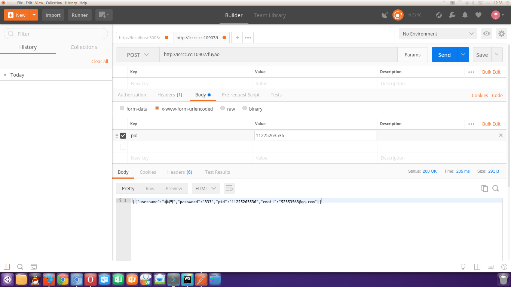

# 李娜的数据
* method: GET
* host: icccc.cc
* port: 20907
* api: lina
* path param: id
* usage
  + special id:
    - http://icccc.cc:20907/lina/1
    - http://icccc.cc:20907/lina/15
  + all:
    - http://icccc.cc:20907/lina/all

# 付瑶的JSON数据
* method: POST
* host: icccc.cc
* port: 10907
* api: fuyao
* path param: no param
* usage
  + special pid:
    - require a json string, can be tranlate to a object, with a property named pid, which was a number string, 11 bit, it can
represent a phone number.
    - 
  + all:
    - require a plain string, '{"pid": "all"};
    - 

